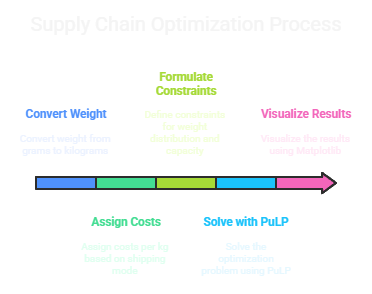

📦 Supply Chain Optimization – Task 4
TechNest Data Science Internship

📝 Objective
This project aims to minimize the total logistics cost across different shipment modes and warehouses by using Linear Programming. Constraints are added to ensure fairness in mode usage and respect warehouse capacity limits.

📁 Files
supply_chain_optimization.ipynb – Jupyter Notebook implementing the optimization using PuLP and visualizing results.

train.csv – Dataset containing shipment details.

README.md – Project overview and instructions.

📊 Dataset Overview
The dataset includes:

Warehouse_block – Warehouse category (A–F)

Mode_of_Shipment – Shipment mode (Flight, Ship, Road)

Weight_in_gms – Product weight

Cost_of_the_Product, Discount_offered, and delivery status

🔧 Methodology

Converted weight to kg from grams.

Assigned costs per kg based on shipping mode:

Flight: ₹20/kg

Ship: ₹10/kg

Road: ₹5/kg

Formulated constraints:

Total shipped weight = Actual total weight

20%–50% weight must be distributed across each shipment mode

Each warehouse can ship up to 110% of its original total capacity

Solved using PuLP (linear programming)

Visualized results using Matplotlib

📈 Key Outputs
Optimal weight allocation per warehouse and shipment mode

Total minimized shipping cost

Summary stats and distribution charts

▶️ How to Run
Install dependencies:

pip install pandas pulp matplotlib numpy
Run the notebook:
Open supply_chain_optimization.ipynb in Jupyter or Google Colab.

Ensure train.csv is in the same directory as the notebook.

💡 Skills Demonstrated
Operations research

Linear programming

Data wrangling with Pandas

Data visualization

Optimization modeling with constraints
